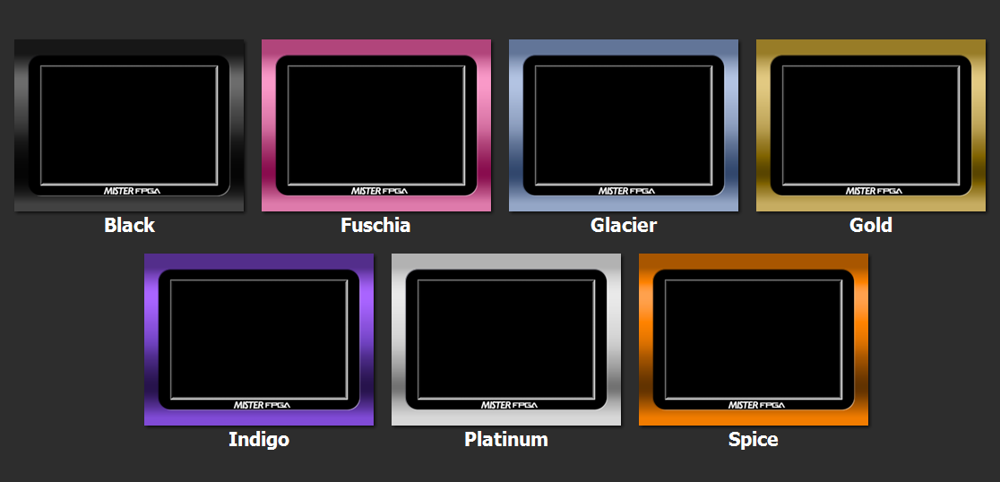

# README

This repository contains community-made borders, along with extracted Game Boy Player borders, converted for use with the MiSTer Game Boy Advance core.

## Installation

Files must be in `.bor` format.  By default, the GBA core looks for borders in `/games/GBA`; I recommend creating a subfolder inside that directory, such as `/games/GBA/Borders`, to help keep things organized.  

Once you’ve copied your `.bor` files over, open the core menu and go to **Video & Audio → Borders: On** to enable them.

These GBA Borders have now officially been added to the `update_all`, so if you are running the script simply press `up` for **settings**, and you'll find the option to download them under **extra content**.  They will then download to `/games/GBA/Borders` on your system.

If you're NOT using `update_all`, and you’d like your `Downloader` script to automatically grab the latest borders from this repository, add this line to the end of your `downloader.ini`:

```
[Dinierto/MiSTer-GBA-Borders]
db_url = https://raw.githubusercontent.com/Dinierto/MiSTer-GBA-Borders/db/db.json.zip
```

## Template

Inside the `Tools` folder, you’ll find a Photoshop template (`MiSTer GBA Border Template.psd`) for creating your own borders. It includes guides for image center (yellow), GBA display area (green), and overscan (red).  There is also a `.png` file that shows these areas, if you can't open a `.psd` file.  Keep in mind that the GBA display area is a 240 x 160 rectangle centered inside the 320 x 240 image.

Try to avoid placing important details outside the red lines (or inside the red area, if you're using the `.png` template), as they may be cut off by CRT overscan. When you’re done, export your image as a **bitmap (.bmp)** file.

If you don't have a graphical editing program, both [GIMP](https://www.gimp.org/) and [Paint.net](https://www.getpaint.net/) are free options and can edit the `.psd` format.  If you want to use Paint.net, you will need to download the `.psd` plugin from [here](https://www.psdplugin.com/).

## Creating borders

There are two scripts in the `Tools` folder for generating border files: `convertBorder.py` and `convertfolder.py`. Both require your input image(s) to be a 320x240 **.bmp** file.

To convert a single `.bmp` file:

```
convertBorder.py <input_file.bmp> <output_file.bor>
```

To convert all `.bmp` files in the folder:

```
convertfolder.py
```

Depending on your operating system, you may be able to run `convertfolder.py` directly from your file explorer without opening a command prompt.

Warning!  You may get the following error:

```
Traceback (most recent call last):
  File "<convertBorder.py path>", line 2, in <module>
    from PIL import Image # pip install Pillow
```

If so then you will need to go to the command line and type in the following command to install Pillow:

```
pip install Pillow
```

## Screen alignment tool

The `Tools` folder also includes a special border called `Alignment test.bor`. This is useful for adjusting the screen alignment in the latest GBA core, which allows tweaking horizontal and vertical positioning. The border features alternating color bars every 5 pixels to help with alignment.

## Border Thumbnails

### Anime0t4ku Border Pack

<br>

### GBA Micro

<br>

### GC & GB Player

<br>

### Metallic

<br>

### misterKunBorder.png

<br>

### RW Gameboy Advance

<br>

### Solid

<br>

### Super Gameboy Advance

<br>

### Textures

<br>

### tunnotron3000

<br>

## Contributers

**FPGAzumSpass**- Core developer, border conversion scripts

**Dinierto**- Github repository, border template, alignment test border, border conversions, borders (Metallic, Solid, Brushed Steel, Wood Grain)

**tunnotron3000**- Borders (tunnotron3000)

**Richard Webster**- Borders (RW Gameboy Advance, Super Gameboy Advance)

**Anime0t4ku**- Borders (Anime0t4ku Border Pack)
